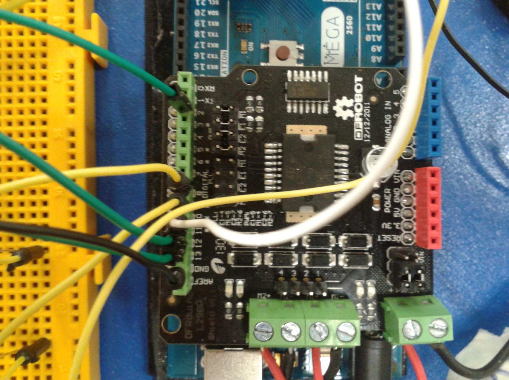
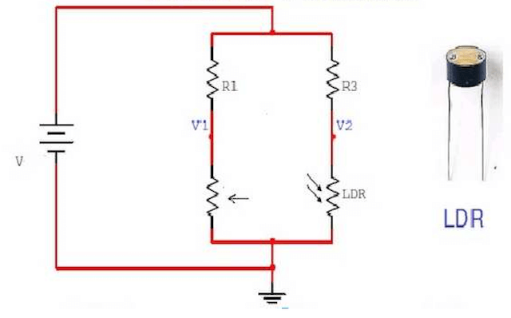
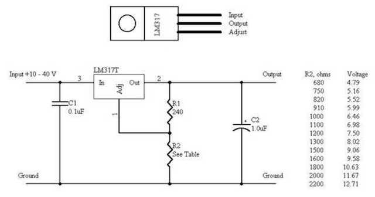

# CIRCUITOS
En esta sección se muestra todo lo relacionado con los circuitos de acondicionamiento asociados a los sensores que se han utilizado con los valores de resistencias, condensadores y otros componentes usados.

## DRIVER DE MOTORES. PUENTE EN H
Un *"Puente H"* o *"Puente en H"* es un [circuito electrónico](https://es.wikipedia.org/wiki/Puente_H_(electrónica) que permite a un motor eléctrico CC girar en ambos sentidos, avance y retroceso. Son ampliamente usados en robótica y como convertidores de potencia. Los puentes H están disponibles como circuitos integrados, pero también pueden construirse a partir de componentes discretos.

El puente en H junto con los motores de continua, nos permiten una movilidad total del autómata que junto con la posibilidad de la utilización de [señales PWM](https://www.arduino.cc/en/Tutorial/PWM) del Arduino, hacen de la programación una tarea relativamente sencilla. El puente en H usado para este proyecto nos permite utilizar dos motores, esta basado en el clásio puente en H **L298**, pero integrado en una shield para colocar sobre el arduino, lo que nos facilita enormemente la estabilidad del mismo, así como una compactación mayor de la electrónica.

## PUENTE DE WEATHSTONE Y COMPARADOR POR HISTÉRESIS
Compuesto por:
+ LDR
+ Potenciómetro 10K
+ 2 Resistencias 6.4K
+ 2 Resistencias 10K
+ 1 Resistencia 100K
+ Condensador de 0.1uF
+ **Comparador LM311**

Conexiones externas de funcionamiento:
+ Pin digital 31 de Arduino Mega
+ VCC
+ GND

El circuito es una configuración de [puente de Wheatstone](https://es.wikipedia.org/wiki/Puente_de_Wheatstone) con las 2 resistencias de 6.4K, LDR y potenciómetro, este último para a justar la tensión de offset de salida del puente:

Introducimos las salidas del puente a las entradas `V+` y `V-` del comparador **LM311**. La histéresis del comparador será a justada con las resistencias de `R1` y `R2`. La salida del comparador será introducida en el pin digital de Arduino que se desee. Este, recibirá un valor lógico en función de la cantidad de luz a la que la LDR sea expuesta. Gracias a esto podremos generar una interrupción en el microcontrolador para el control de los LEDs de iluminación sin tener que evaluar el valor  óhmico de la LDR de manera constante. Ampliaremos este concepto en la sección [Código](./code.html).

## REGULADOR DE TENSIÓN LM317
Compuesto por el regulador de tensión **LM317** y las resistencias de ajuste. La introducción del regulador LM317 en nuestro proyecto surge tras la imposibilidad de la placa Arduino para alimentar, recordemos que esta placa puede suministrar un máximo de 500 mA, todos los sensores y actuadores que hasta el momento estaban siendo alimentados por ella. Para solucionar el problema mencionado se decidió agregar otra batería de 6V (1,5V de cada pila x4) que ya usábamos para alimentar Arduino. Esta nueva fuente alimentaría los ultrasonidos y el módulo de recepción de radiofrecuencia, ambos, como la mayoría de los dispositivos electrónicos, con un voltaje recomendado de 5V. Para la obtención de 5V a través de la fuente de 6V sencillamente se tuvo que acondicionar el regulador LM317 con las resistencias adecuadas como muestra la siguiente figura. El circuito usado es análogo pero prescindiendo del *condensador* dada la gran estabilidad de los 6V de la fuente de tensión.

## CONTROL REMOTO
Compuesto por:
+ Interruptor triestado
+ Arduino Uno
+ Transmisor RF
+ Cableado
+ Antena
+ Switches
+ Resistencias

Usaremos esta unidad para controlar tanto el modo de funcionamiento, como los movimientos, dentro del modo manual, del robot. Ofreceremos tres modos de funcionamiento:
+ **Modo Parada**: El robot no realizará tarea alguna y permanecerá a la espera de un cambio de modo consumiendo la mínima energía.
+ **Modo Movimiento automático**: El robot comenzará a moverse por el espacio atendiendo a sus sensores de ultrasonidos para evitar colisiones mientras aspira.
+ **Modo Movimiento manual**: El usuario puede controlar los movimientos del robot mediante los botones del módulo de control remoto.
