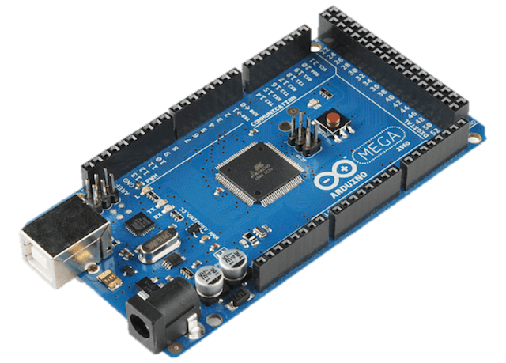
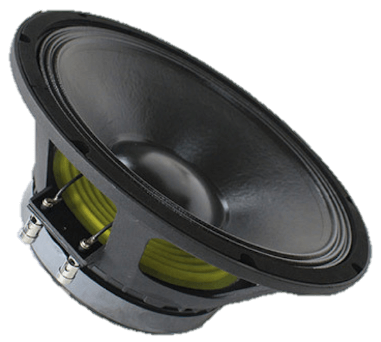

# COMPONENTS
In this section you can find all the documentation related to the electronic components used. All its characteristics are described as well as its use and its relationship with the rest of the components. This block is divided in [Processing](#processing), [Sensors](#sensors) y [Actuators](#actuators).

## PROCESSING
For the processing we opted for using the [Arduino](https://www.arduino.cc) platform, albeit it is not oriented to comercial purposes, it is oriented to building prototypes in an wasy way thanks to its connections and its ease of microcontroller programming in both cases an AVR. Two Arduino boards were used, one in charge of the control of the robot itself and the other one for the remote that controls its switch on and manual movement.

### Arduino Mega
The [Arduino Mega](https://store.arduino.cc/product/GBX00067) is a board based on microcontroller ATmeg1280. It counts with 54 digital input/outputs (from which 14 are PWM signal capable outputs), 16 digital inputs, 4 UARTS (hardware serial ports), an oscillator crystal at 16MHz, USB connection, current input, ISP connector and a reset button.

### Arduino Uno
The [Arduino Uno](https://store.arduino.cc/product/GBX00066) is a board base on microcontroller ATmega328. It counts with 14 digital input/outputs (from which 6 are PWM signal capable outputs), 6 analogic, a 16MHz crystal, USB connection, ICSP inputs and a reset button. It differs from its antecessors in the lack of FTDI USB-to-serial driver chip, instead it uses a ATmega8U2

---

## SENSORS

### Ultrasonic
Ultrasonic sensors are proximity sensors that detects objects in a wide range of distances depending on the type of the sensor. These reflect an object, the sensor receives the echo produced and converts it into an electric signal which are made in the valuation part. These kind of sensors only work when used in air and can detect objects in several shapes, colors, surfaces and materials. Materials can be solid, liquid or dusty, however they must be sound baffles. The sensors work depending on the time past for the echo, i.e. it values the temporal distance between the emission impulse and the echo impulse. In our case, we have used three sensors to cover a more than 220º field aprox. This was made to make possible three modes of work depending on which sensors are active, as for example in the mode where the robot escapes corners or where it avoids moving objects. The ultrasonic model used has been **SRF04**. This sensor is capable of detecting objects and measure the distance in which they are place in a range from 3 to 300 cm. It contains all the electronic that calculates the distance. To use it you only have to send a pulse and measure the width of the echo.

With a very small size, SRF04 has a very low power consumption, big accuracy and low cost.

|  |   |
|:---:|:---:|

### LDR
LDR stands for Light-Dependent Resistor. It consists of a photoresistor, an electronic component whose resistance is lower with the rise of the light intensity. Its body is build with a cell and two pins. The model used in our project has been  **GL5528** whose characteristics are:
+ Resistance (with light) : ~1k Ohm
+ Resistance (darkness): ~10k Ohm
+ Vmax : 150V
+ Dissipation: 100mW max

|  |   |
|:---:|:---:|

---

## ACTUATORS

### Motors
Motors chosen for the moving task are 12V. DC motors. One of these motors is a machine that transforms electric energy into kinetic, making a spinning movement. A DC machine (motor or generator) is composed generally by two parts: A *stator* that gives stabilty and mechanical support to the machine and has a hollow inside usually cylindrical. In the statos also there are two poles that can be permanent magnets or windings with copper filament around the iron core. The *rotor* is generally cylindrical also with a winding and a core where the current is driven through brushes. There are also DC motors built with a permanent magnets rotor aiming special necessities. Using this kind of motors instead of stepper motors for example is the connection simplicity, availability and its ease of programming when combined with the *H bridge* that will be described later on.

|  |   |
|:---:|:---:|

### Piezo
The piezoelectric sensors based on the [piezoelectric effect](https://en.wikipedia.org/wiki/Piezoelectricity), generation of electrical charge resulting from an applied mechanical force. In this case is used to make a set of sounds that indicates the start of the robot as well as a buzzer that make noise in manual mode. In order to manage this sensor we created a specific library. To make it work we turned on and off one of its pins and controlling that frecuency it played a note.

|  |   |
|:---:|:---:|

### LCD
A LCD is a liquid crystal display where we show info. It has 4 rows and 20 columns.

### RF Transmitter/receiver
Wireless communication with **RX-TX A315**, with two modules, the *transmitter* and the *receiver*. Both devices are used separately and from afar so the the receiver is connected to the robot itself while the transmitter is used in other arduino which will serve as a remote control.

The communication of these modules with the respective microcontroller is made using a digital pin on the board and using a serial protocol. Once both modules are properly connected we will send and receive packets wirelessly using the functions provided by the library [Virtualwire](https://www.pjrc.com/teensy/td_libs_VirtualWire.html). You must take into account the effect that the receiver module has on internal AVR Timers, used for PWM pins. That is why we will only enable the reception of information in some intervals, never concurring with PWM signals. When the data transmission has ended, we will disable the receiver module.
