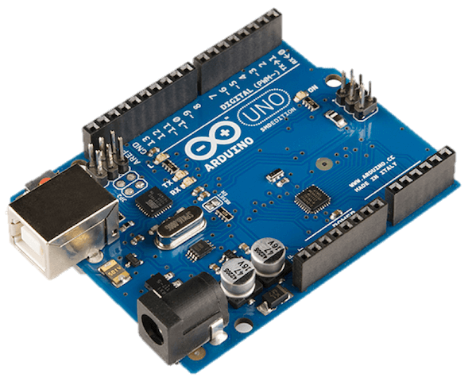
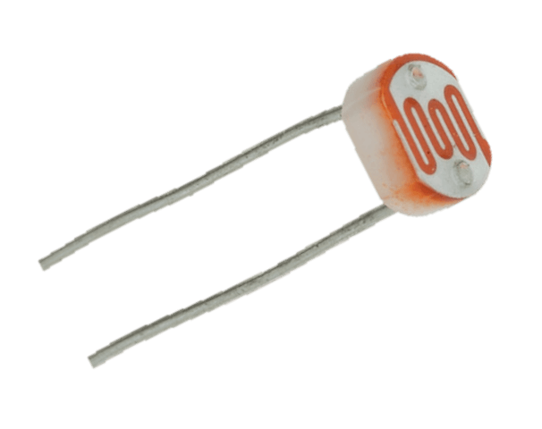
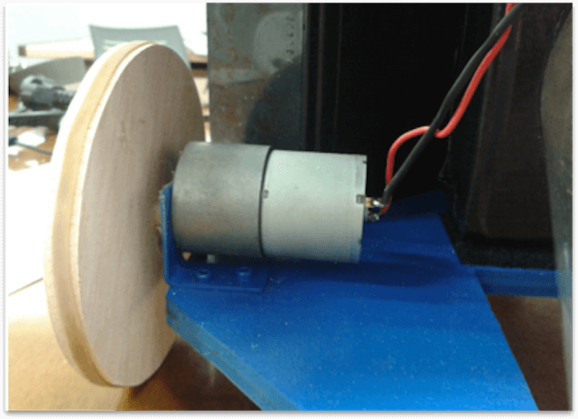
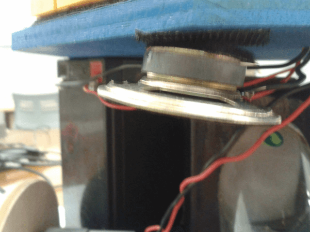

# COMPONENTES
En esta sección se encuentra toda la docuemtanción relacionada con los componentes electrónicos utilizados. Se describen sus características y el uso que se le dieron así como su relación con los demás elementos. Este bloque se divide en [Procesamiento](#procesamiento), [Sensores](#sensores) y [Actuadores](#actuadores).

## PROCESAMIENTO
Para el proesamiento se ha optado por utilizar la plataforma Arduino, que si bien, no está orientada para propósito comerial, si que lo está para realizar prototipos de una manera senilla debido a sus onexiones, y failidad de programaión del miroontrolador en ambos asos de la familia AVR. Se han usado dos plaas Arduino, una para el ontrol autómata del robot, y otra para el mando a distania que ontrola su enendido y ontrol remoto.

### Arduino Mega
El Arduino Mega es una plaa miroontrolador basada ATmeg1280. Tiene 54 entradas/salidas digitales (de las uales 14 proporionan salida PWM), 16 entradas digitales, 4 UARTS (puertos serie por hardware), un ristal osilador de 16MHz, onexión USB, entrada de orriente, onetor ICSP y botón de reset.

### Arduino Uno
El Arduino Uno es un miroontrolador basado en el ATmega328. Tiene 14 salidas digitales de entrada/salida (6 de las uales pueden ser usadas omo PWM), 6 analógias, un ristal a 16MHz, onexión USB, entradas ICSP y botoón de reset. Se distingue de sus predeesores en que no usa el FTDI USB-to-serial driver hip. En su lugar usa un Atmega8U2.

---

## SENSORES

### Ultrasonidos
Los sensores de ultrasonidos son detetores de proximidad que detetan ob jetos a distanias variables según el tipo de sensor. Estos reejan en un ob jeto, el sensor reibe el eo produido y lo onvierte en señales elétrias, las uales son elaboradas en el aparato de valoraión. Estos sensores traba jan solamente en el aire, y pueden detetar ob jetos on diferentes formas, olores, superies y de diferentes materiales. Los materiales pueden ser sólidos, líquidos o polvorientos, sin embargo han de ser deetores de sonido. Los sensores traba jan según el tiempo de transurso del eo, es deir, se valora la distania temporal entre el impulso de emisión y el impulso del eo. En nuestro aso, hemos usado tres sensores de ultrasonidos para ubrir un ampo de más de unos 220º aproximadamente. Esto se ha heho así, para disernir entre varios modos de funionamiento según se ative un detetor u otro, omo por ejemplo el modo para esapar de esquinas, para detetar un ob jeto móvil que aaba de ruzarse et. El modelo de ultrasonidos elegido ha sido el SRF04. Este sensor es apaz de detetar ob jetos y alular la distania a la que se enuentran en un rango de 3 a 300 m. Contiene toda la eletrónia enargada de haer la mediión. Su uso es tan senillo omo enviar el pulso de arranque y medir la anhura del pulso de retorno. De muy pequeño tamaño, SRF04 destaa por su ba jo onsumo, gran preisión y ba jo preio.

|  |   |
|:---:|:---:|

### LDR
Son las siglas de Light-Dependent Resistor. Es una fotorresistenia, un omponente eletrónio uya resistenia disminuye on el aumento de intensidad de luz inidente. Su uerpo está formado por una élula o elda y dos patillas. El modelo usado para nuestro proyeto ha sido el GL5528 uyas araterístias son:
+ Resistenia (on luz) : ~1k Ohm
+ Resistenia (osuridad): ~10k Ohm
+ Vmax : 150V
+ Disipaión: 100mW max

|  |   |
|:---:|:---:|

---

## ACTUADORES

### Motores
Los motores esogidos para la parte motriz del robot, son motores de orriente ontinua de 12 voltios. Un motor de , es una máquina que onvierte la energía elétria en meánia, provoando un movimiento rotatorio. Una máquina de orriente ontinua (generador o motor) se ompone prinipalmente de dos partes:Un estátor que da soporte meánio al aparato y tiene un hueo en el entro generalmente de forma ilíndria. En el estátor además se enuentran los polos, que pueden ser de imanes permanentes o devanados on hilo de obre sobre núleo de hierro. El rotor es generalmente de forma ilíndria, también devanado y on núleo, al que llega la orriente mediante dos esobillas. También se onstruyen motores de CC on el rotor de imanes permanentes para apliaiones espeiales. El heho de utilizar este tipo de motores en lugar de motores paso a paso por ejemplo es por la simpliidad de onexión, la disponibilidad de los mismos y la failidad de programaión de los mismo junto on un puente en H que desribiremos a continuaión.

|  |   |
|:---:|:---:|

### Piezo
Los sensores piezoelétrios basados en el efeto piezoelétrio el ual produe un potenial elétrio a partir de modiar una de sus propiedades físias. En este aso es usado para produir una serie de sonidos que indian el inicio de la puesta en marha del robot, así omo una boina que suena en el modo manual por movimiento on radio freuenia.
Para el funionamiento de este dispositivo se ha reado una librería uyo prinipio de funionamientos se expliará más adelante. Está basado en la alternania del enendido y el apagado de un pin de salida de manera que alulando este número de enendidos y apagados variemos el valor de freuenia, equivalente a una nota.

|  |   |
|:---:|:---:|

### LCD
Una LCD es una pantalla de ristal líquido donde mostramos informaión dirigida desde el arduino. Consta de 4 las y 20 columnas.

### Emisor/Receptor RF
Comuniaión inalámbria on módulos RX-TX A315, se compone de dos módulos, el emisor y el receptor. Dado que ambos dispositivos se usan por separado y a distancia, el receptro se conecta en el propio robot mientras que el emisor se usa con otro arduino, que hará de control remoto.

La comuniaión de estos módulos on el mirocontrolador al ual estén conetados se realiza mediante un pin digital ualquiera de la plaa del miroontrolador en protoolo serie. Una vez realizada la orreta onexión de los módulos,realizaremos el envio y reepión de paquetes de manera inalámbria, mediante las funiones que proporiona la librería Virtualwire. Hay que tener espeial uidado on los efetos que tiene la onguraión del módulo de reepión sobre los Timers del AVR ya que estos son usados también por los pines PWM, por ello solo habilitaremos la reepión en determinados intervalos de tiempo no onurrentes on el uso de PWM,transurrido el intervalo de reepión, deshabilitamos el módulo reeptor.
