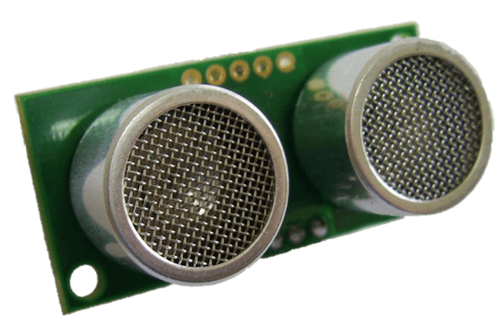
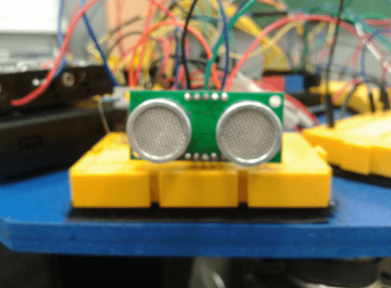
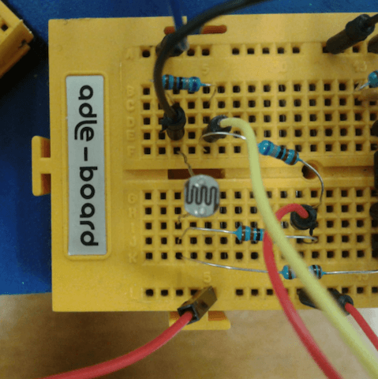
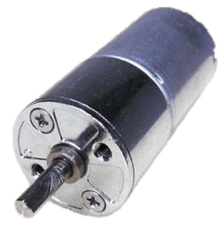
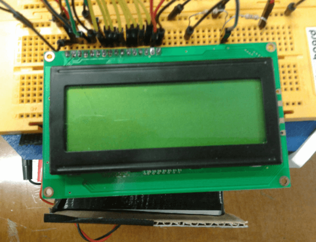

# COMPONENTES
En esta sección se encuentra toda la documentación relacionada con los componentes electrónicos utilizados. Se describen sus características y el uso que se le dieron así como su relación con los demás elementos. Este bloque se divide en [Procesamiento](#procesamiento), [Sensores](#sensores) y [Actuadores](#actuadores).

## PROCESAMIENTO
Para el procesamiento se ha optado por utilizar la plataforma Arduino, que si bien, no está orientada para propósito comercial, si que lo está para realizar prototipos de una manera sencilla debido a sus conexiones, y facilidad de programación del microcontrolador en ambos casos de la familia AVR. Se han usado dos placas Arduino, una para el control autómata del robot, y otra para el mando a distancia que controla su encendido y control remoto.

### Arduino Mega
El Arduino Mega es una placa microcontrolador basada ATmeg1280. Tiene 54 entradas/salidas digitales (de las cuales 14 proporcionan salida PWM), 16 entradas digitales, 4 UARTS (puertos serie por hardware), un cristal oscilador de 16MHz, conexión USB, entrada de corriente, conector ICSP y botón de reset.

### Arduino Uno
El Arduino Uno es un microcontrolador basado en el ATmega328. Tiene 14 salidas digitales de entrada/salida (6 de las cuales pueden ser usadas como PWM), 6 analógicas, un cristal a 16MHz, conexión USB, entradas ICSP y botón de reset. Se distingue de sus predecesores en que no usa el FTDI USB-to-serial driver hip. En su lugar usa un Atmega8U2.

---

## SENSORES

### Ultrasonidos
Los sensores de ultrasonidos son detectores de proximidad que detectan objetos a distancias variables según el tipo de sensor. Estos reflejan en un objeto, el sensor recibe el eco producido y lo convierte en señales eléctricas, las cuales son elaboradas en el aparato de valoración. Estos sensores trabajan solamente en el aire, y pueden detectar objetos con diferentes formas, colores, superficies y de diferentes materiales. Los materiales pueden ser sólidos, líquidos o polvorientos, sin embargo han de ser deflectores de sonido. Los sensores traba trabajan según el tiempo de transcurso del eco, es decir, se valora la distancia temporal entre el impulso de emisión y el impulso del eco. En nuestro caso, hemos usado tres sensores de ultrasonidos para cubrir un campo de más de unos 220º aproximadamente. Esto se ha hecho así, para discernir entre varios modos de funcionamiento según se active un detector u otro, como por ejemplo el modo para escapar de esquinas, para detectar un objeto móvil que acaba de cruzarse et. El modelo de ultrasonidos elegido ha sido el SRF04. Este sensor es capaz de detectar objetos y calcular la distancia a la que se encuentran en un rango de 3 a 300 m. Contiene toda la electrónica encargada de hacer la medición. Su uso es tan senillo como enviar el pulso de arranque y medir la anchura del pulso de retorno. De muy pequeño tamaño, SRF04 destaca por su bajo consumo, gran precisión y bajo precio.

|  |   |
|:---:|:---:|

### LDR
Son las siglas de Light-Dependent Resistor. Es una fotorresistencia, un componente electrónico cuya resistencia disminuye con el aumento de intensidad de luz incidente. Su cuerpo está formado por una célula o celda y dos patillas. El modelo usado para nuestro proyecto ha sido el GL5528 cuyas características son:
+ Resistencia (con luz) : ~1k Ohm
+ Resistencia (oscuridad): ~10k Ohm
+ Vmax : 150V
+ Disipaión: 100mW max

|  |   |
|:---:|:---:|

---

## ACTUADORES

### Motores
Los motores escogidos para la parte motriz del robot, son motores de corriente continua de 12 voltios. Un motor de CC, es una máquina que convierte la energía eléctrica en mecánica, provocando un movimiento rotatorio. Una máquina de corriente continua (generador o motor) se compone principalmente de dos partes: Un estátor que da soporte mecánico al aparato y tiene un hueco en el centro generalmente de forma cilíndrica. En el estátor además se encuentran los polos, que pueden ser de imanes permanentes o devanados con hilo de cobre sobre núcleo de hierro. El rotor es generalmente de forma cilíndrica, también devanado y con núcleo, al que llega la corriente mediante dos escobillas. También se construyen motores de CC con el rotor de imanes permanentes para aplicaciones especiales. El hecho de utilizar este tipo de motores en lugar de motores paso a paso por ejemplo es por la simplicidad de conexión, la disponibilidad de los mismos y la facilidad de programación de los mismo junto con un puente en H que describiremos a continuación.

|  |   |
|:---:|:---:|

### Piezo
Los sensores piezoeléctricos basados en el efecto piezoeléctrico el cual produce un potencial eléctrico a partir de modificar una de sus propiedades físicas. En este aso es usado para producir una serie de sonidos que indican el inicio de la puesta en marcha del robot, así como una “boina” que suena en el modo manual por movimiento con radio frecuencia.
Para el funcionamiento de este dispositivo se ha creado una librería cuyo principio de funcionamiento se explicará más adelante. Está basado en la alternancia del cenendido y el apagado de un pin de salida de manera que calculando este número de encendidos y apagados variemos el valor de frecuencia, equivalente a una nota.

|  |   |
|:---:|:---:|

### LCD
Una LCD es una pantalla de cristal líquido donde mostramos información dirigida desde el arduino. Consta de 4 filas y 20 columnas.

### Emisor/Receptor RF
Comunicación inalámbrica con módulos RX-TX A315, se compone de dos módulos, el emisor y el receptor. Dado que ambos dispositivos se usan por separado y a distancia, el receptor se conecta en el propio robot mientras que el emisor se usa con otro arduino, que hará las veces de control remoto.

La comunicación de estos módulos con el microcontrolador al cual estén conectados se realiza mediante un pin digital cualquiera de la placa del microcontrolador en protocolo serie. Una vez realizada la correcta conexión de los módulos, realizaremos el envío y recepción de paquetes de manera inalámbrica, mediante las funciones que proporciona la librería Virtualwire. Hay que tener especial cuidado con los efectos que tiene la configuración del módulo de recepción sobre los Timers del AVR ya que estos son usados también por los pines PWM, por ello solo habilitaremos la recepión en determinados intervalos de tiempo no concurrentes con el uso de PWM, transcurrido el intervalo de recepción, deshabilitamos el módulo receptor.
